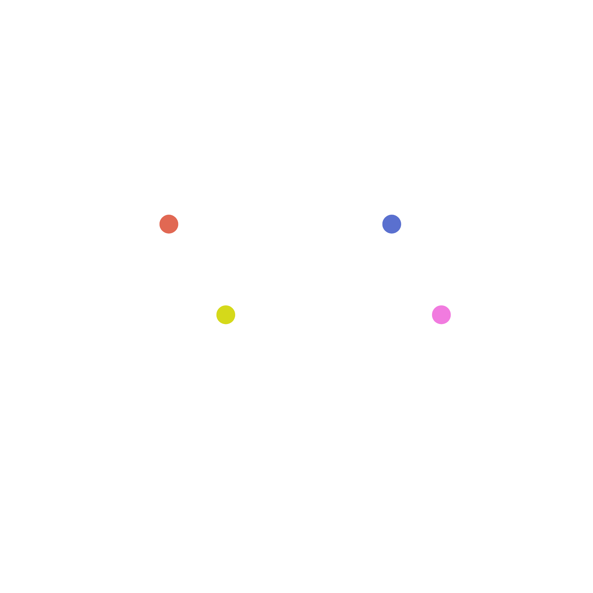

<!-- PROJECT LOGO -->

  

<h3 align="center"><b>Sign Up Form</b></h3>

    For a Graphic Designing Company

 

<!-- ABOUT THE PROJECT -->
## Preview
> **Note**  
>> Application is still under Development

 

## Built With

- !HTML5  
- !CSS3

 

## Outcome

* Used HTML5 **semantic elements** for better readability and structure
* Used CSS3 **grid** and **flex** to manage layouts
* Used **Git** and **GitHub** for project management
* Tried to maintain **clean code**

 

## What I learned

* HTML form validations
* CSS Grid

 

<!-- ACKNOWLEDGMENTS -->
## Acknowledgments

* Inspiration by The Odin Project
* Illustrative vectors was provided by Freepik

 

<!-- LICENSE -->
## License

- Distributed under the MIT License. See `LICENSE` for more information.

 

<!-- CONTACT -->
## Author

